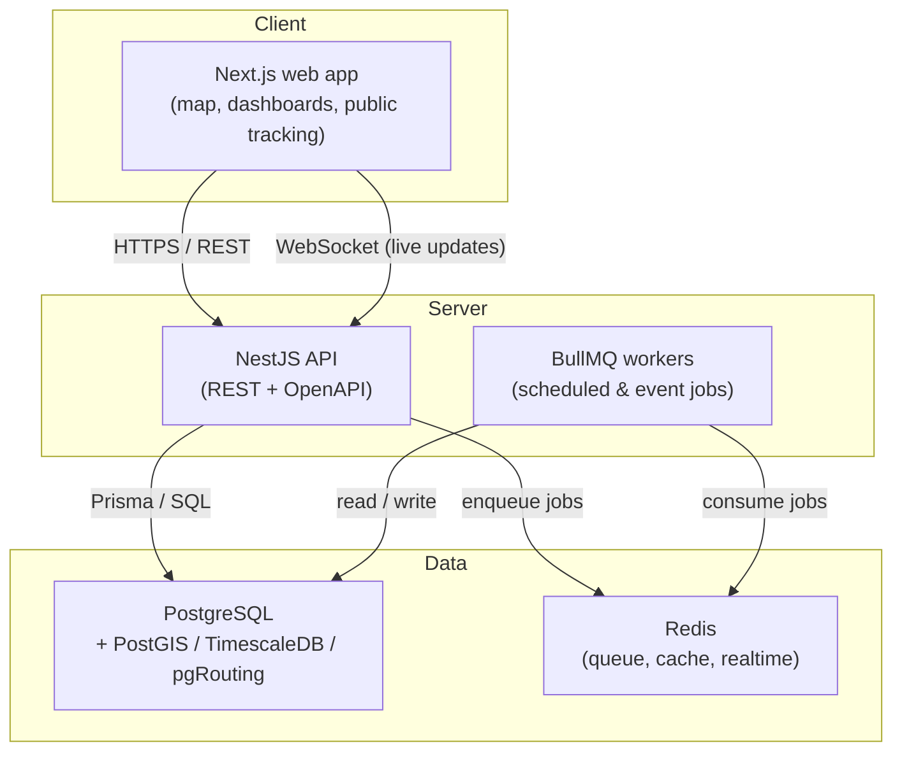

# Architecture

This document explains **how the system is put together**, **how the pieces connect**, and
**why each technology was chosen**. It is the single reference for understanding the project's
technical shape.

---

## 1. Overview

The platform is a **TypeScript monorepo** with two applications and shared code, backed by a
single PostgreSQL database and Redis, all runnable locally with Docker Compose.

## 2. How everything is connected

| Component | Runs on | Talks to | How |
|---|---|---|---|
| Web (Next.js) | `:3000` | API | REST over HTTP; WebSockets for live updates |
| API (NestJS) | `:3001` | PostgreSQL, Redis | Prisma (SQL) + `ioredis`/BullMQ |
| PostgreSQL | `:5432` | — | connection string in `DATABASE_URL` |
| Redis | `:6379` | — | `REDIS_URL` |
| Workers (later) | in-process / separate | Redis, PostgreSQL | BullMQ queues |

All configuration flows through a single `.env` file at the repo root (see `.env.example`). Docker
Compose reads it to start the databases; the API reads it via `@nestjs/config`; the web app reads
`NEXT_PUBLIC_*` values.

## 3. Layers (and the golden rule)

The API is organised in layers, from the outside in:

1. **Controllers** — HTTP endpoints, request validation (DTOs), OpenAPI docs.
2. **Services (domain logic)** — the actual business rules (tracking status, due-date logic,
   emissions math). *This is the valuable, testable core.*
3. **Data access** — Prisma repositories + raw SQL for spatial / time-series / routing queries.

> **Golden rule:** domain logic in the service layer must not depend on HTTP or Prisma specifics.
> Keeping it framework- and database-agnostic makes it testable and portable as the project grows.

## 4. Data model (Phase 1)

- **Vessel** — a ship (IMO, type, capacity, flag, status).
- **Port** — a location (UN/LOCODE, country, coordinates). A real PostGIS `geometry(Point,4326)`
  column is added via a raw SQL migration; `latitude`/`longitude` are kept for convenience.
- **Container** — a box (ISO number, type, status) linked to its current port and vessel.

Later phases add **Voyage**, **PortCall**, **TrackingEvent** (time-series), **Certificate**, and
**EmissionRecord**.

## 5. Why these technologies

The choices are optimised for one solo developer building a learning + portfolio + potential
product, in a domain that is **geographic, event-driven, and real-time**.

| Area | Choice | Why this, and what else was considered |
|---|---|---|
| Language | **TypeScript** everywhere | One language across API and web means shared types and fast context-switching. Considered: Python/FastAPI (great if the project leans into ML/ETA prediction later). |
| API framework | **NestJS** | Opinionated structure (modules, DI) with first-class OpenAPI, WebSocket, and queue support — less glue code than Express. Considered: bare Express (too unstructured), Fastify. |
| Database | **PostgreSQL** | One database covers three data shapes this domain needs, via extensions — avoiding a polyglot stack early. Considered: MongoDB (weaker for relational + geo), a dedicated graph DB. |
| Geospatial | **PostGIS** | The industry standard: store positions/routes as real geometry and run spatial queries. |
| Time-series | **TimescaleDB** | Container tracking events are high-volume time-series; a Postgres extension keeps it in one DB. |
| Routing | **pgRouting** | Shortest-path / transshipment routing without adding a separate graph database. |
| ORM | **Prisma** | Type-safe models + migrations + great DX; drop to raw SQL for PostGIS/Timescale. Considered: TypeORM (rougher DX), Drizzle. |
| Frontend | **Next.js + React** | Routing, SSR, and a polished single framework — ideal for a portfolio-quality UI. |
| Styling | **Tailwind CSS** (+ shadcn/ui) | Professional, consistent UI built quickly and fully controllable. |
| Maps | **MapLibre GL JS** | Open-source, high-performance vector maps — the visual centrepiece. Considered: Mapbox (nicer defaults, usage-based cost), Leaflet (raster-first). |
| Jobs / realtime | **BullMQ + Redis**, WebSockets, MQTT | Off-request-path work (ETAs, expiry checks, emissions); MQTT for streaming AIS positions later. |
| Infra | **Docker Compose** | One command to run the whole stack locally, reproducible everywhere. |
| CI | **GitHub Actions** | Automated checks on every push; visible engineering discipline for the portfolio. |

## 6. Scaling path (later, only if needed)

- Split BullMQ workers into their own process/container.
- Swap the DB image for one bundling TimescaleDB + PostGIS; add pgRouting.
- Add read replicas / connection pooling (PgBouncer) under load.
- Introduce a message broker (Kafka/RabbitMQ) if AIS ingestion volume demands it.

Start simple; add these only when real usage justifies the complexity.
